# 🏗️ Diagramas Arquiteturais - Gestrategic

## 1. Arquitetura Geral do Sistema

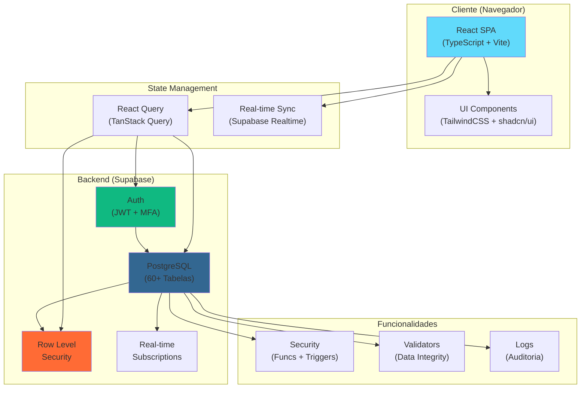

---

## 2. Estrutura de Tipos TypeScript

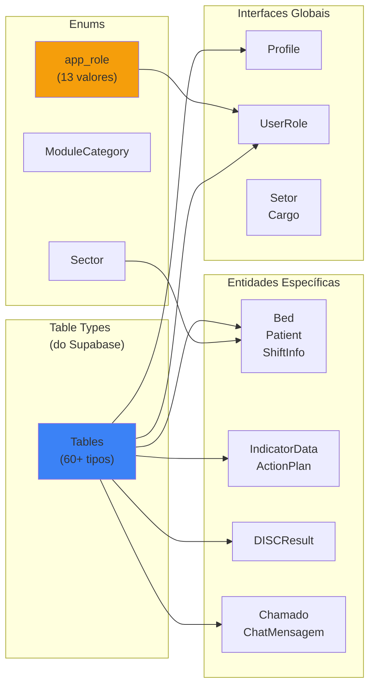

---

## 3. Hierarquia de Autenticação & Autorização

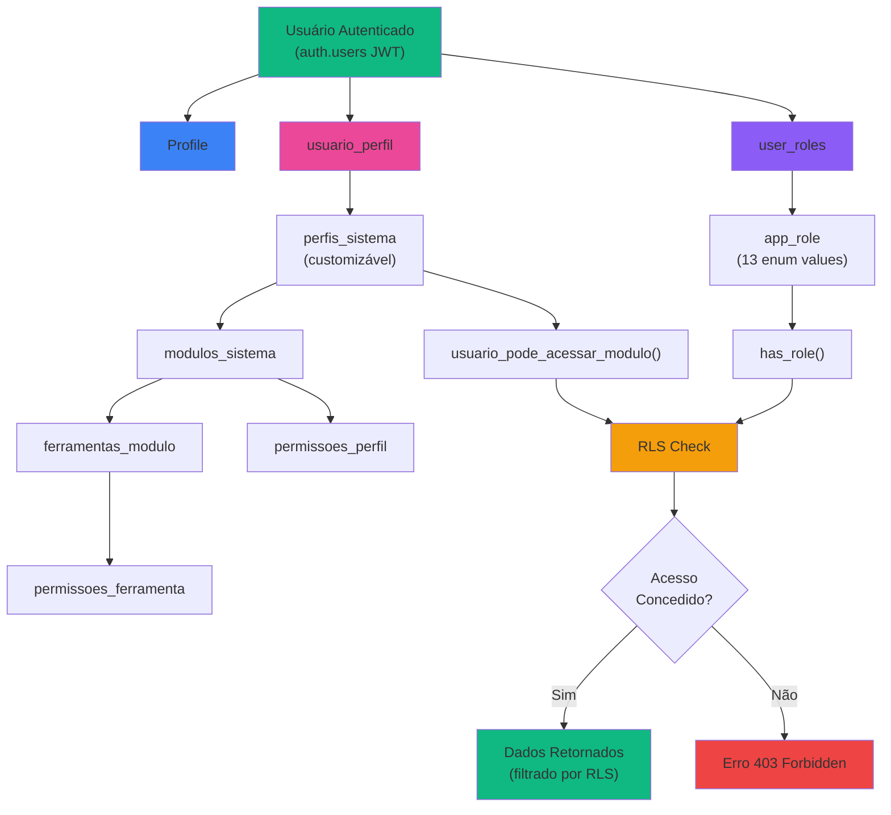

---

## 4. Fluxo de Autenticação

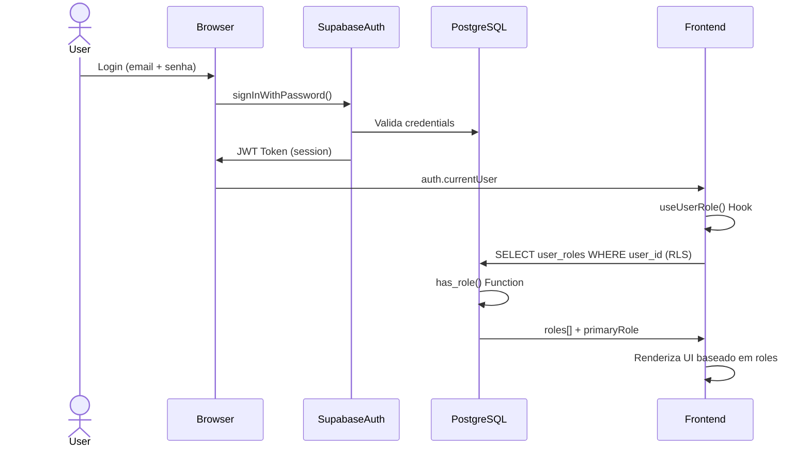

---

## 5. Estrutura de Banco de Dados

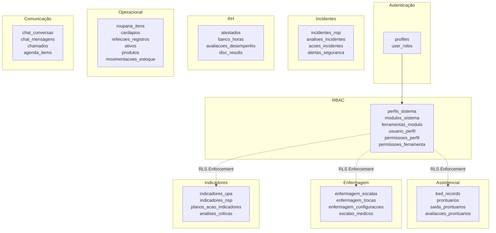

---

## 6. Hooks Customizados por Domínio

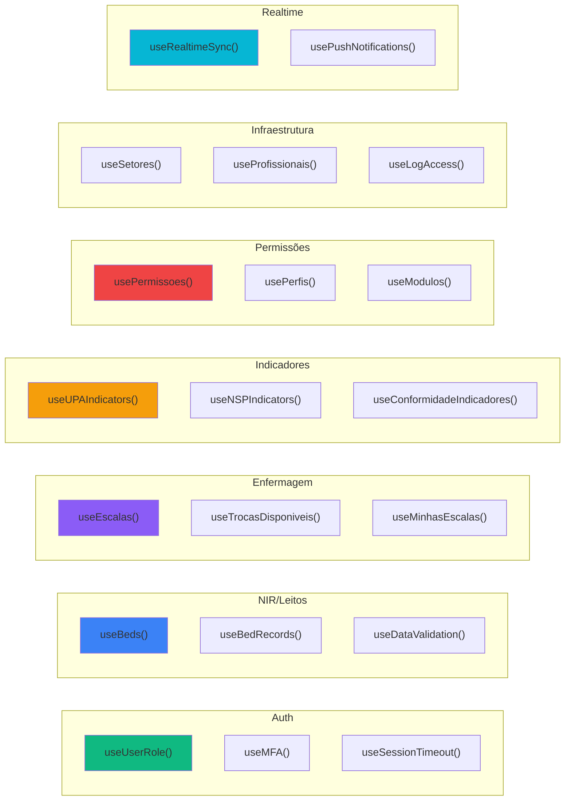

---

## 7. Fluxo de Dados em Tempo Real

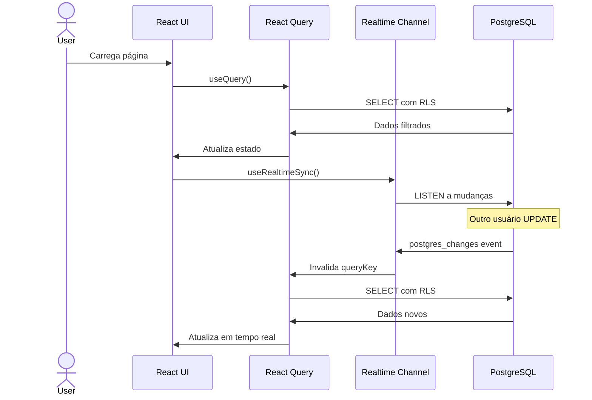

---

## 8. Row Level Security - Padrões

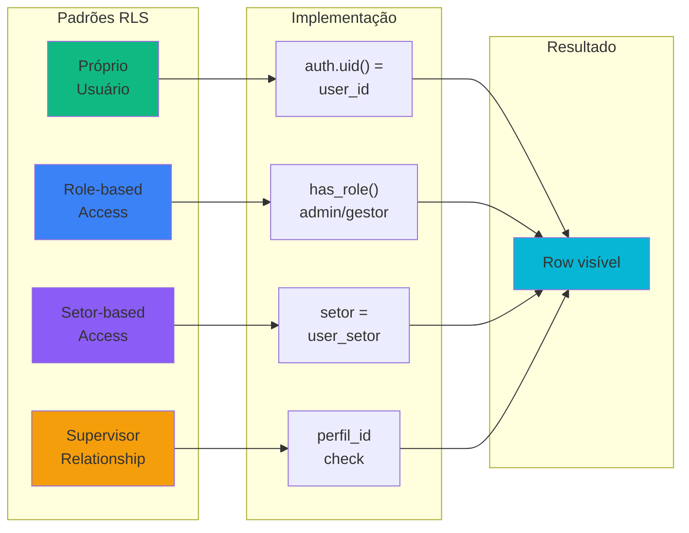

---

## 9. Dados Capturados por Domínio

```mermaid
graph TB
    subgraph "NIR<br/>(Real-time)"
        D1["Pacientes: 2-5K"]
        D2["Leitos com RLS"]
        D3["Turnos: D/N"]
    end

    subgraph "Enfermagem"
        E1["Escalas: 200-500"]
        E2["Trocas: 50-100"]
    end

    subgraph "Indicadores"
        I1["UPA: 180+ tipos"]
        I2["NSP: Incidentes"]
        I3["Conformidade"]
    end

    subgraph "RH"
        R1["Colaboradores: 300"]
        R2["Avaliações: 800-1K"]
        R3["DISC: 200-300"]
    end

    subgraph "Operacional"
        O1["Rouparia: 100-200/dia"]
        O2["Restaurante: 50-100"]
        O3["Manutenção: 50-100"]
    end

    subgraph "Comunicação"
        C1["Chat: 1K+ msg/dia"]
        C2["Chamados: 50-100"]
        C3["Agenda: Tasks"]
    end

    D1 --> OUT["Análise<br/>Consolidada"]
    E1 --> OUT
    I1 --> OUT
    R1 --> OUT
    O1 --> OUT
    C1 --> OUT

    style D1 fill:#06b6d4
    style I1 fill:#f59e0b
    style R1 fill:#8b5cf6
    style O1 fill:#10b981
    style C1 fill:#3b82f6
```

---

## 10. Pesonalização: Novo RBAC (perfis_sistema)

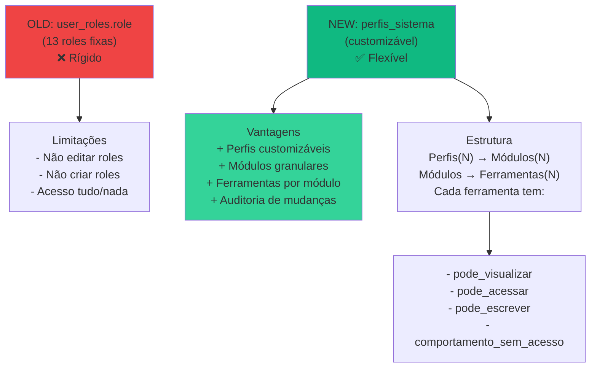

---

## 11. Fluxos Críticos de Dados

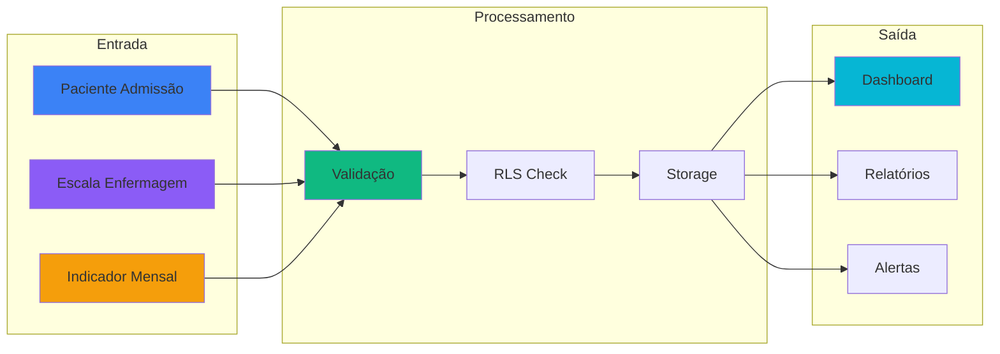

---

## 12. Módulos do Sistema (30+)

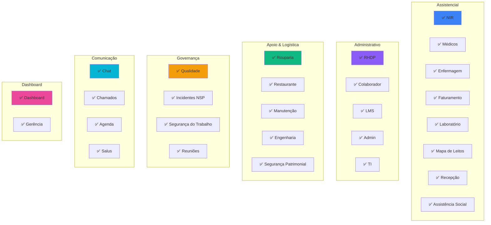

---

## 13. Ciclo de Vida de um Registro (Exemplo: Chamado)

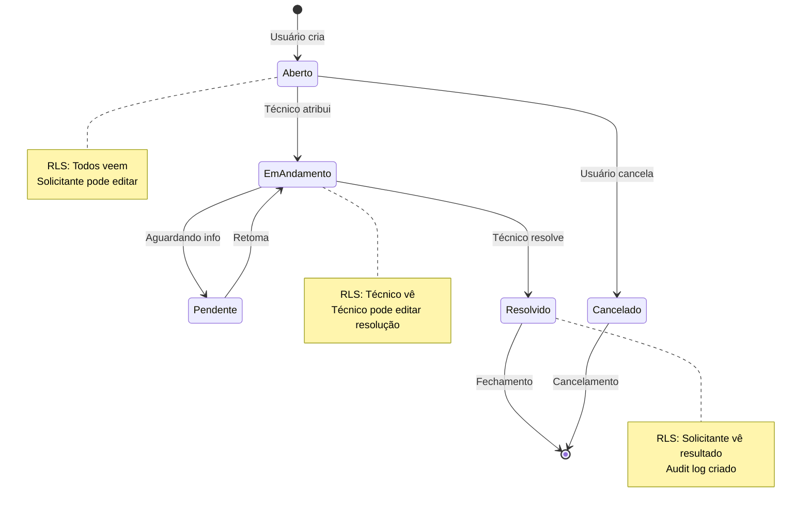

---

## 14. Stack Tecnológico

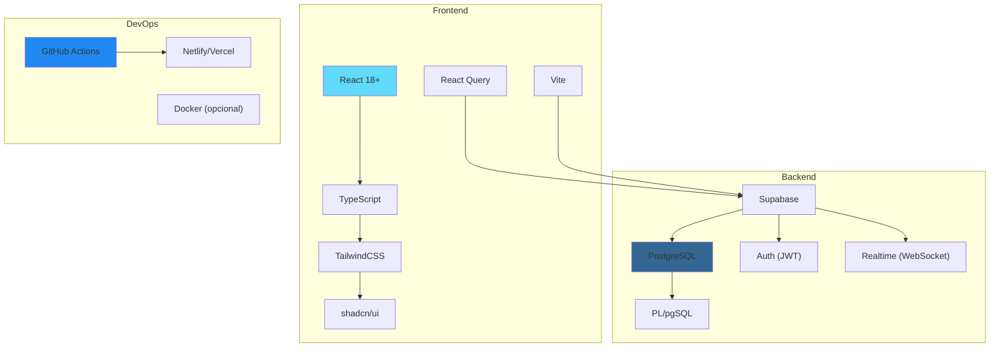

---

## 15. Segurança em Camadas

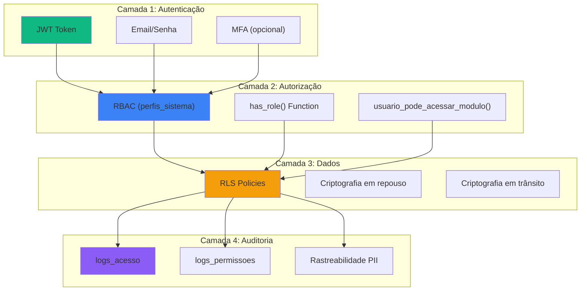

---

## 16. Coleta de Dados - Volume & Frequência

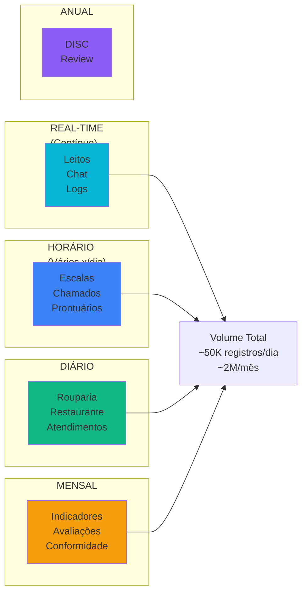

---

**Diagramas Mermaid renderizáveis** - Use em: [mermaid.live](https://mermaid.live)

